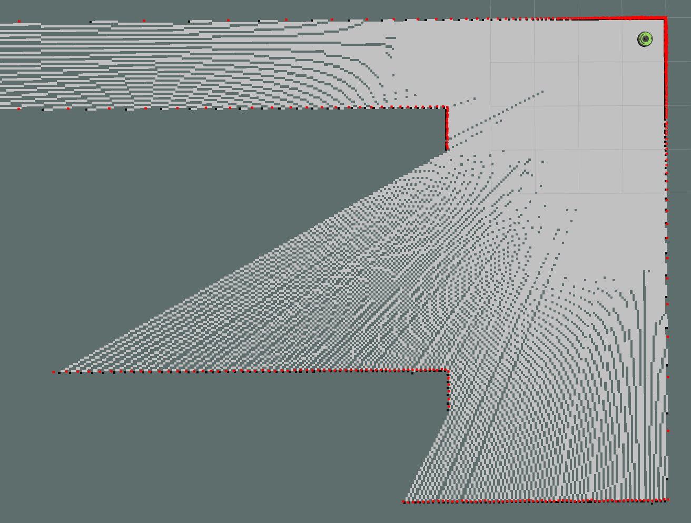

# Robotics
Autonomous Navigation for Roomba robot in ROS and Gazebo

## Installation

Clone this repository in your workspace

```
git clone https://github.com/ramajoballester/robotics.git
```

Install the python packages required

```
cd robotics/
sudo -H pip install -r requirements.txt
```
Clone the [aws-robomaker-small-house-world package](https://github.com/aws-robotics/aws-robomaker-small-house-world) in the root of your workspace

```
cd ..
git clone https://github.com/aws-robotics/aws-robomaker-small-house-world.git
```


## Examples

SLAM mapping launch file

``` bash
roslaunch robotics mapping.launch
```


Autonomous navigation

```
roslaunch robotics autonomous.launch
```

Autonomous multi-robot navigation and task allocation

```
roslaunch robotics autonomous_multi_house.launch
```
